# Global Entry Appointment Finder


This tool queries the TTP CBP system for Global Entry interview appointments within a specified date range, filters them by state, and then **exports the data** in CSV by default or **posts summaries to Slack** if enabled in `.jeff`. It can run once or repeatedly at a defined interval, preserving the full JSON data of each location if desired.

---

## Features

- **Parallel fetching** for multiple dates  
- **Configurable** states, date range, concurrency, retry logic via `.jeff`  
- **Rate-limiting** to avoid API overload  
- **CSV export** (default) with:
  - Search date
  - Location data (ID, name, phone, etc.)
  - Full raw JSON of the returned object
- **Slack integration** (set `enable_slack = true` in `.jeff`)
- One-shot or continuous operation based on `fetch_interval_minutes` (looping vs. single run)

---

## Requirements

- [Docker](https://docs.docker.com/get-docker/) and [Docker Compose](https://docs.docker.com/compose/)
- **Optional** Slack credentials if you want Slack output
- A `.jeff` config file at the project root

---

## Configuration

Create a `.jeff` file in your project root. Example:

```json
{
  "enable_slack": false,
  "slack_token": "xoxb-...",
  "slack_channel_id": "C01234567",
  "fetch_interval_minutes": 0,
  "search_states": [
    "AL","AK","AZ","AR","CA","CO","CT","DE","FL","GA",
    "HI","ID","IL","IN","IA","KS","KY","LA","ME","MD",
    "MA","MI","MN","MS","MO","MT","NE","NV","NH","NJ",
    "NM","NY","NC","ND","OH","OK","OR","PA","RI","SC",
    "SD","TN","TX","UT","VT","VA","WA","WV","WI","WY"
  ],
  "date_range": {
    "start": "2025-01-01",
    "end": "2025-02-23"
  },
  "api_rate_limit_seconds": 1.0,
  "max_concurrent_fetches": 5,
  "max_retries": 3
}
```

### Key Fields

- **`enable_slack`**  
  - `true` → Post to Slack  
  - `false` → Write `appointments.csv`  
- **`fetch_interval_minutes`**  
  - `0` → Run once and exit  
  - `> 0` → Repeatedly fetch every N minutes  
- **`search_states`**: 2-letter codes for states to filter  
- **`date_range`**: Start/end in `YYYY-MM-DD`  
- **`api_rate_limit_seconds`**: Delay between requests  
- **`max_concurrent_fetches`** and **`max_retries`**

---

## Usage

1. **Build & Run**  
   ```bash
   make build
   make run
   ```
2. **Logs**  
   ```bash
   make logs
   ```
3. **Stop**  
   ```bash
   make stop
   ```

When `enable_slack = false`, a CSV file (`appointments.csv`) is generated, showing **Date, ID, Name, State, City, Address, PostalCode, Phone, RawJSON**. This captures **all** details returned by the TTP API.

With `enable_slack = true`, it will post a **Slack message** summarizing the first few locations, rather than exporting CSV.

---

## Docker Compose Workflow

- **Multi-stage build** for smaller final images  
- Mounts `.jeff` read-only so local changes appear in-container  
- **Restart** unless stopped to keep going if `fetch_interval_minutes > 0`

---

## Mermaid Flow

```mermaid
flowchart TB
    A[Start Application] --> B[Load .jeff Config]
    B --> C[Initialize Reqwest Client and Slack Token]
    C --> D[Check fetch_interval_minutes]
    D -- "0" --> E[Run Once, Fetch Appointments]
    D -- "Non-Zero" --> F[Loop Forever]
    E --> G[Fetch for Each Date in Range]
    F --> G
    G --> H[Filter by States]
    H --> I[Convert to CSV Rows / Slack Data]
    I --> J{enable_slack?}
    J -- "No" --> K[Write to CSV &#40;includes raw JSON&#41;]
    J -- "Yes" --> L[Post Slack Summary]
    K --> M[End or Sleep]
    L --> M[End or Sleep]
    M -- "Loop" --> N[Wait fetch_interval_minutes]
    N --> G
    M -- "Once" --> O[Stop]
```



- **A→B→C→D**: Reads config, sets up HTTP/Slack.  
- **E/F**: Single run vs loop.  
- **G→H**: Fetch & filter.  
- **H→I**: Prepare CSV or Slack.  
- **J** → Slack or CSV.  
- **M** → End or sleep for next cycle.  